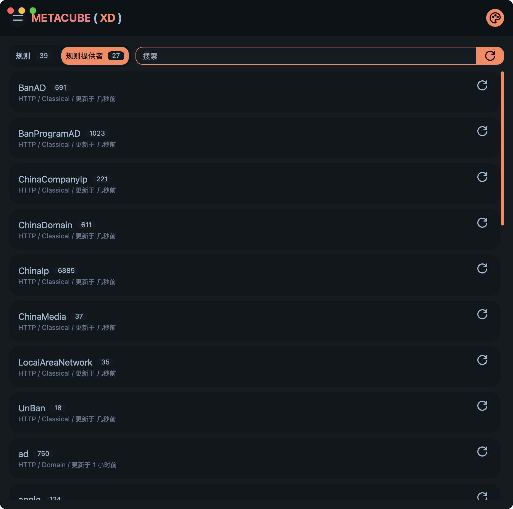

# 项目名称

Clash 规则转换器

## 项目描述

本项目旨在将 Clash 规则转换为 ClashX Meta 使用的规则。它会读取`Input`目录中的所有`.txt`文件，并将其内容转换为适用于 ClashX Meta 的 YAML 格式，最终结果保存在`output`目录中。在转换过程中，项目会跳过任何非`.txt`文件，并输出处理信息。

## 文件说明

- `modify-file.py`: 主程序文件，负责读取输入文件、转换数据并保存输出。
- `Input`: 存放待处理`.txt`文件的目录。
- `output`: 存放转换后 YAML 文件的目录。

## 使用方法

1. 将待处理的`.txt`文件放入`Input`目录。
2. 运行`modify-file.py`脚本。
3. 转换后的适用于 ClashX Meta 的 YAML 文件将保存在`output`目录中。

## 注意事项

- 确保`Input`目录中仅包含需要处理的`.txt`文件。
- 运行脚本前，`output`目录中的内容将被清空。

## 依赖

- Python 3.x
- PyYAML 库

## 安装依赖

在项目根目录下运行以下命令以安装所需的 Python 库：

pip install pyyaml
